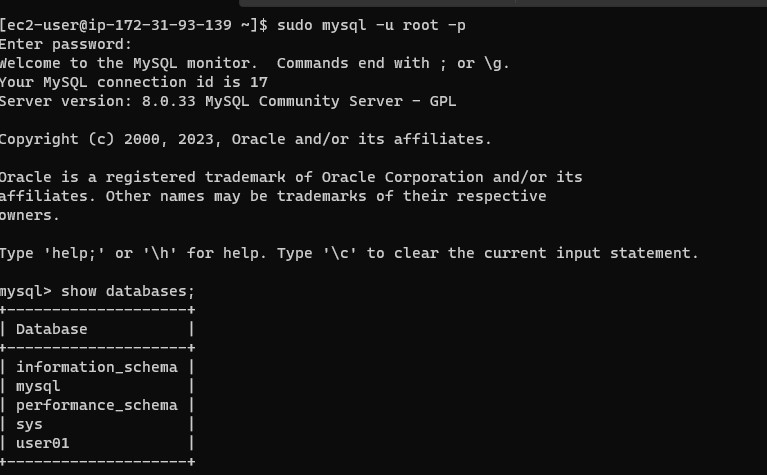
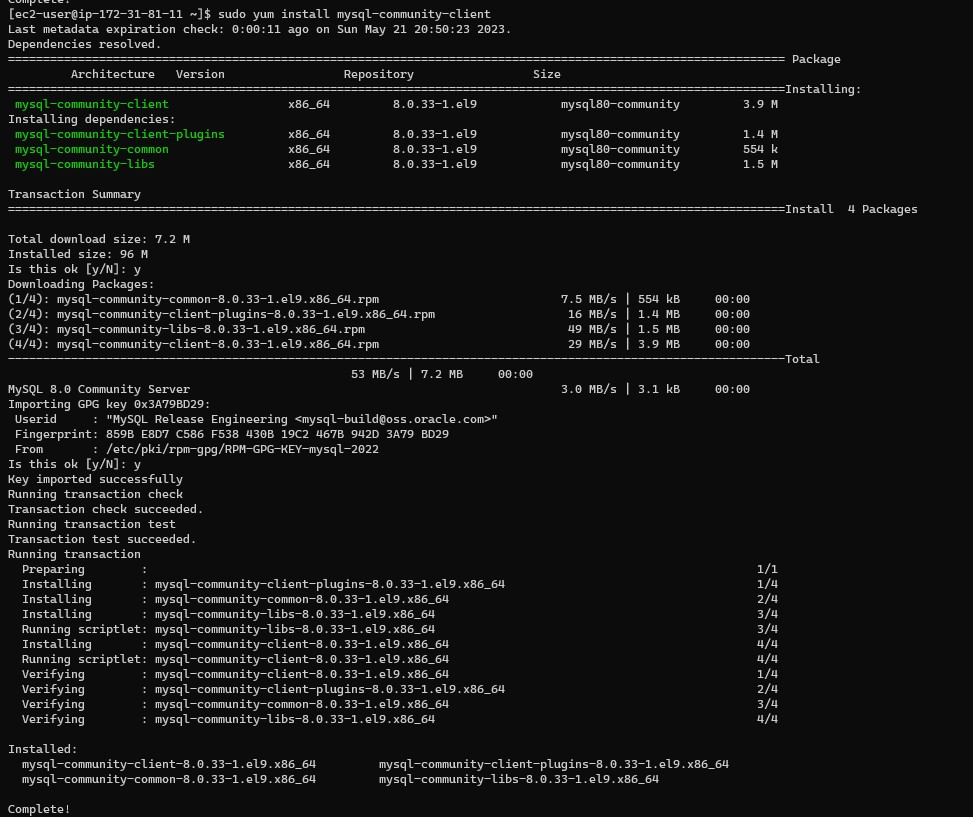

## **Project 5 - Implementing a Client Server Architecture using MySQL Database Management System (DBMS).**

## Network Diagnostic Utilities
### PING

    ping is a computer network administration software utility used to test the reachability of a host on an Internet Protocol (IP) network. It is available for virtually all operating systems that have networking capability, including most embedded network administration software.

    Ping measures the round-trip time for messages sent from the originating host to a destination computer that are echoed back to the source. The name comes from active sonar terminology that sends a pulse of sound and listens for the echo to detect objects under water.


### TRACERT/TRACEROUTE

    Tracert and Traceroute are computer network diagnostic commands for displaying possible routes (paths) and measuring transit delays of packets across an Internet Protocol (IP) network.


## **LABs**

> Step 1 - Create and configure two Linux-based virtual servers (EC2 instances in AWS).


> Step 2 - Installing MySQL server on the first server

    sudo apt install mysql-server 

> Edit security group and enable port 3306 for inbound connections


> After installation, login into the MySQL console

    sudo mysql

> Set the root password 

```SQL
    ALTER USER 'root'@'localhost' IDENTIFIED WITH mysql_native_password BY 'PassWord.1';
```


> Exit the MySQL shell

    exit
 


> Start the interactive mysql script and go through the wizard

    sudo mysql_secure_installation


> Login into the the MySQL console with the new 'root' password 

    sudo mysql -p


> Exit the MySQL console

    exit


> Step 3 - Edit MySQL configuration file, change the bind addressess settings and enable remote connection

    sudo vi /etc/mysql/mysql.conf.d/mysqld.cnf

    Under the bind addresses section, replace ‘127.0.0.1’ to ‘0.0.0.0’ 

    Enable remote connection 

    Under basic settings, uncomment port = 3306 by removing the '#' sign


> Restart MySQL server

    sudo systemctl enable mysql


> Create a new user on MySQL server for remote connection using the local ip address

    CREATE USER 'funmibi'@'local-Ip-address' IDENTIFIED WITH mysql_native_password BY 'password';

    GRANT ALL PRIVILEGES ON *.* TO 'funmibi'@'local-ip-address' WITH GRANT OPTION;

    FLUSH PRIVILEGES;



> Install mysql client on the second server 

    sudo apt install mysql-client-core-8.0




> Connect to the MySQL server from the client server without using SSH

    mysql -u username -h mysql_server_ip -p

    mysql -u funmibi -h 172.31.86.242 -p


