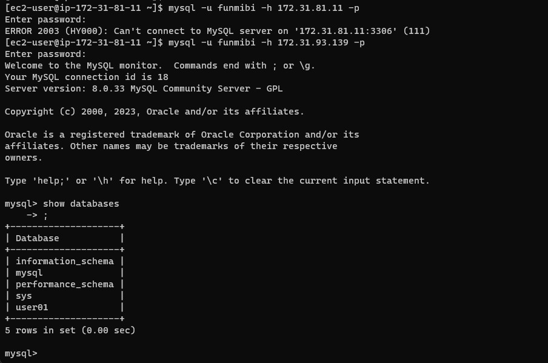

## **Project 5 - Implementing a Client Server Architecture using MySQL Database Management System (DBMS).**

## Network Diagnostic Utilities
### PING

    ping is a computer network administration software utility used to test the reachability of a host on an Internet Protocol (IP) network. It is available for virtually all operating systems that have networking capability, including most embedded network administration software.

    Ping measures the round-trip time for messages sent from the originating host to a destination computer that are echoed back to the source. The name comes from active sonar terminology that sends a pulse of sound and listens for the echo to detect objects under water.


### TRACERT/TRACEROUTE

    Tracert and Traceroute are computer network diagnostic commands for displaying possible routes (paths) and measuring transit delays of packets across an Internet Protocol (IP) network.


# **LABs**

> Step 1 - Create and configure two Linux-based virtual servers (EC2 instances in AWS).


> Step 2 - Installing MySQL server on the first server

    sudo wget  https://dev.mysql.com/get/mysql80-community-release-el9-1.noarch.rpm 
---
    sudo dnf install -y mysql80-community-release-el9-1.noarch.rpm
---
    sudo dnf repolist enabled | grep "mysql.*-community.*"
---
    sudo dnf install mysql-community-server -y
---
    sudo systemctl start mysqld
    sudo systemctl status mysqld
    sudo systemctl enable mysqld

> Edit security group and enable port 3306 for inbound connections


> After installation, login into the MySQL console

    sudo grep 'temporary password' /var/log/mysqld.log

> Connect to MySQL – Change temporary password

```SQL
    sudo mysql_secure_installation
```

> Login in mysql server after installation

    sudo mysql -u root -p


> Exit the MySQL shell

    exit
 


> Step 3 - Edit MySQL configuration file, change the bind addressess settings and enable remote connection

    sudo vi /etc/my.cnf

    Under the [mysqld] section, add the following line

        bind-address = 0.0.0.0 


> Restart MySQL server

    sudo systemctl restart mysqld

> Create a new user on MySQL server for remote connection using the local ip address

    sudo mysql -u root -p
---
    CREATE USER 'funmibi'@'172.31.81.11' IDENTIFIED BY '8x9d/flp?(Rf';
---
    GRANT ALL PRIVILEGES ON *.* TO 'funmibi'@'172.31.81.11' WITH GRANT OPTION;
---
    FLUSH PRIVILEGES;


> Install mysql client on the second server 

    sudo wget https://repo.mysql.com//mysql80-community-release-el9-1.noarch.rpm
---
     sudo rpm -ivh mysql80-community-release-el9-1.noarch.rpm
---
    sudo dnf repolist enabled | grep "mysql.*-community.*"
---
    sudo yum update
---
    sudo yum install mysql-community-client
---
    sudo mysql --version


> Connect to the MySQL server from the client server without using SSH

    mysql -u username -h mysql_server_ip -p
---
    mysql -u funmibi -h 172.31.84.82 -p




